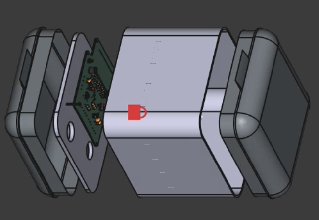
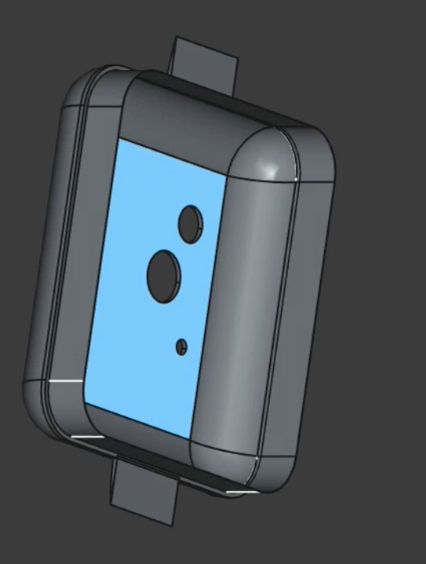
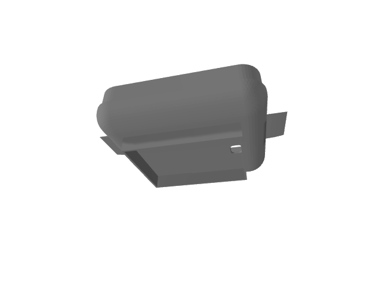
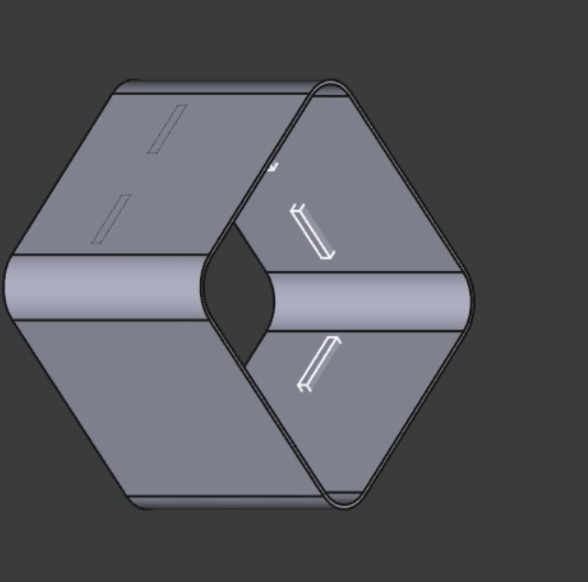
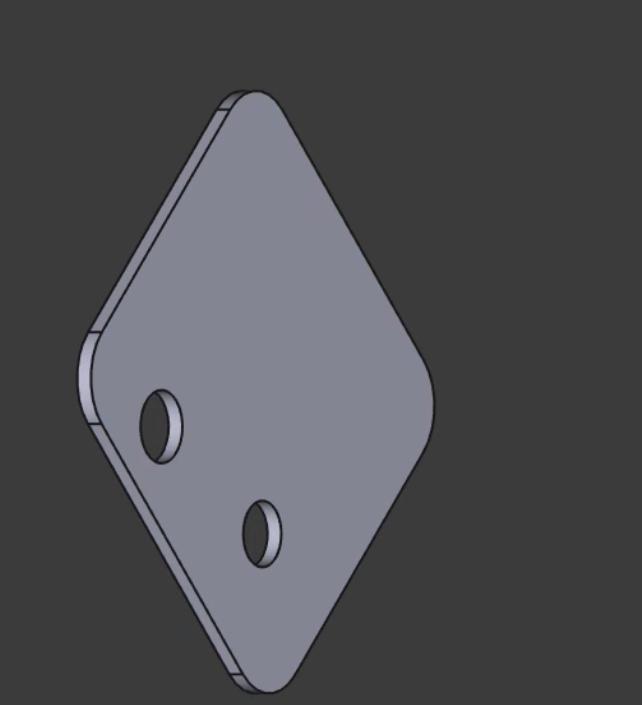

# HydroNex - 🌊 Boîtier Flottant de Surveillance de la Qualité de l'Eau

## 🎯 Caractéristiques Principales

- **Étanchéité** : Boîtier hermétique avec joints d'étanchéité
- **Flottabilité** : Design optimisé pour maintenir la stabilité sur l'eau
- **Modularité** : Assemblage en plusieurs parties pour faciliter la maintenance
- **Autonomie** : Fonctionnement sur batterie avec gestion d'énergie
- **Connectivité** : Transmission des données via WiFi

## 🔧 Composants du Boîtier

### Structure Mécanique
1. **Partie supérieure** (Image 1) : Couvercle avec points de fixation
2. **Corps central hexagonal** (Image 2) : Chambre principale étanche
3. **Assemblage complet** (Image 3) : Boîtier fermé avec écran de statut
4. **Vue éclatée** (Image 4) : Montre l'intégration de l'électronique
5. **Support de montage** (Image 5) : Fixation additionnelle

### Étanchéité
- **Indice IP** : IP67/IP68
- **Profondeur d'immersion** : Jusqu'à 1m
- **Joints** : O-rings en EPDM

### Flottabilité
- **Stabilité** : Centre de gravité bas
- **Orientation** : Maintien automatique en position verticale
- **Charge utile** : Jusqu'à 100g d'équipement supplémentaire

---
## 📐 Spécifications Techniques

### Dimensions
- **Longueur** : ~140mm
- **Largeur** : ~130mm 
- **Hauteur** : ~161.8mm
- **Poids** : < 200g (avec électronique)
---
## 🧰 Composants matériels

- ✅ **ESP32 / ESP-WROOM-32**
- 🌡️ **Capteur DS18B20** – Température
- 💧 **Capteur de pH** – Qualité acide/basique
- 🧂 **Capteur de salinité** (fait maison avec deux électrodes)
- 🌫️ **Capteur de turbidité**
- 🔋 **Batterie LiPo 7.4V**
- ☀️ **Mini panneau solaire 12V**
- 📦 **Boîtier flottant imprimé en 3D (PLA ou PETG)**

---

## 🛠️ Fonctions du système

- Boîtier hermétique, démontable et réutilisable

---

## 🖨️ Impression 3D

- **Matériau recommandé :** PETG (étanche, robuste, hydrophobe)
- **Infill recommandé :** 5 à 10 % (flottabilité)
- **Parois :** 3 walls / 4 top & bottom layers
- **Éléments imprimés séparément :**
- Base du boîtier
- Couvercle clipsable
- Support carte électronique
- Passages pour LED, interrupteur et connecteurs

---

## 🪛 Assemblage

1. Souder les capteurs au microcontrôleur.
2. Placer la carte dans le support imprimé.
3. Insérer les capteurs dans les trous prévus du boîtier.
4. Fermer avec le couvercle clipsable (ou vissé selon version).
5. Tester l’étanchéité avant mise à l’eau.

---

## 📷 Aperçu du prototype

|  |  |  |  |  |  |
|:---:|:---:|:---:|:---:|:---:|:---:|
|  |  |   |  |  |
| *Montre l'intégration de l'électronique* | *base* | *Tête* | *Tronc* |*Support interne*|

---
### Mécanique
- [ ] Boîtier imprimé 3D (PLA/PETG)
- [ ] Joints O-ring
- [ ] Vis inox M3
- [ ] Mousse étanche
- [ ] Lest (si nécessaire)

## 📄 Licence

Ce projet est publié sous licence **MIT**. Libre de l’utiliser, modifier, améliorer !