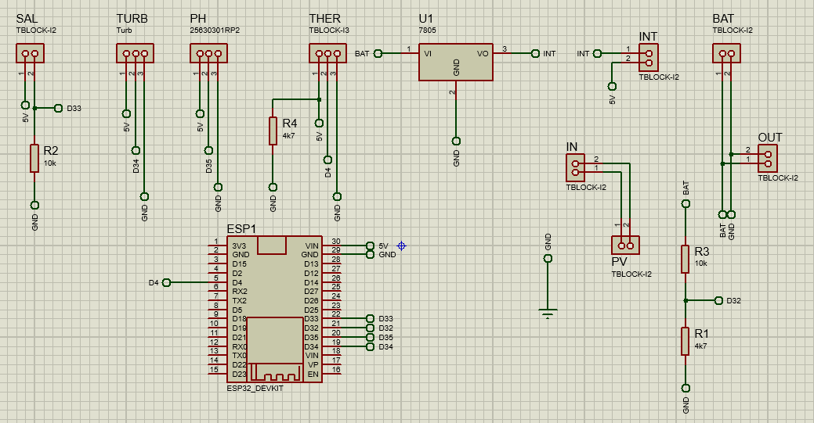
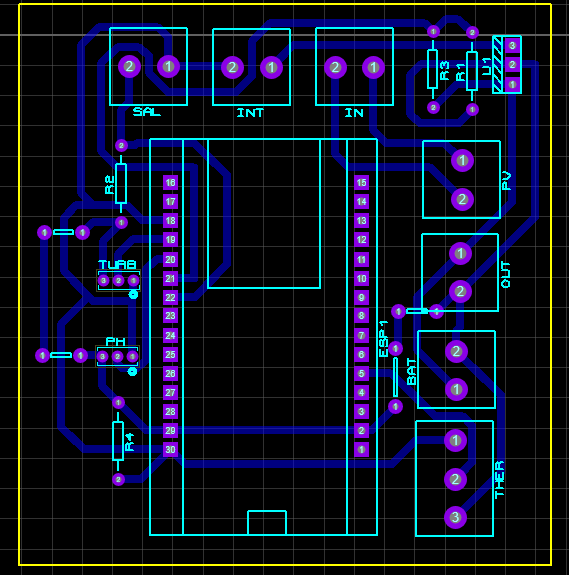
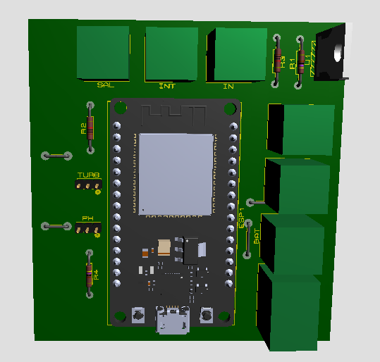

# HydroNex - Module Électronique de Surveillance

Module électronique basé sur ESP32 pour la surveillance de la qualité des eaux côtières avec alimentation solaire.

## 📸 Aperçu du module

| Schéma électronique | Layout PCB | Rendu 3D |
|:---:|:---:|:---:|
|  |  |  |
| *Schéma électronique complet* | *Layout PCB optimisé* | *Rendu 3D du module* |

## 📋 Vue d'ensemble

Module électronique pour la mesure en temps réel des paramètres de qualité d'eau : pH, turbidité, température, salinité et niveau de batterie. Les données sont transmises via Wi-Fi.

## 🔧 Composants principaux

### Microcontrôleur
- **ESP32** (ESP32_DEVKIT) - Microcontrôleur WiFi/Bluetooth dual-core

### Capteurs de qualité d'eau
- **SAL** (TBLOCK-J2) - Capteur de salinité
- **TURB** - Capteur de turbidité  
- **PH** (25630301RP2) - Capteur de pH
- **THER** (TBLOCK-J3) - Capteur de température

### Alimentation
- **PV** (TBLOCK-J2) - Entrée panneau solaire
- **BAT** (TBLOCK-J2) - Connexion batterie
- **U1** (7805) - Régulateur de tension 5V
- **INT** (TBLOCK-J2) - Interface de contrôle

### Interfaces
- **IN** (TBLOCK-J2) - Entrée générale
- **OUT** (TBLOCK-J2) - Sortie générale

### Composants passifs
- **R1** (4k7) - Résistance pull-up
- **R2** (10k) - Résistance de polarisation  
- **R3** (10k) - Résistance de polarisation
- **R4** (4k7) - Résistance pull-up

## 📐 Caractéristiques du PCB

- **Format** : Module compact étanche
- **Couches** : PCB multicouches optimisé
- **Connecteurs** : Blocs terminaux à vis pour connexions externes
- **Alimentation** : Support panneau solaire et batterie avec régulation 5V/3.3V
- **Protection** : Design résistant aux conditions marines

## 🔌 Brochage et connexions

### ESP32 (ESP32_DEVKIT)
- **GPIO** configurables pour les capteurs
- **ADC** pour lecture des niveaux de batterie
- **VIN/GND** pour l'alimentation
- **WiFi** pour transmission des données

### Blocs terminaux
- **PV** : Connexion panneau solaire (entrée alimentation)
- **BAT** : Connexion batterie (stockage énergie)
- **SAL** : Connexion capteur de salinité
- **TURB** : Connexion capteur de turbidité  
- **PH** : Connexion capteur de pH
- **THER** : Connexion capteur de température
- **INT** : Interface de contrôle système
- **IN/OUT** : Entrées/sorties auxiliaires

## ⚡ Alimentation et gestion de l'énergie

- **Entrée principale** : Panneau solaire via connecteur PV
- **Stockage** : Batterie rechargeable via connecteur BAT
- **Régulation** : 7805 pour 5V stable, ESP32 régule en 3.3V
- **Monitoring** : Surveillance du niveau de batterie transmise avec les données
- **Optimisation** : Mode veille entre les mesures pour économiser l'énergie

## 📊 Données transmises

Le module transmet via Wi-Fi les paramètres suivants :
- **pH** - Acidité/basicité de l'eau
- **Turbidité** - Clarté de l'eau
- **Température** - Température de l'eau
- **Salinité** - Concentration en sel
- **Niveau batterie** - État de charge pour maintenance

## 🚀 Configuration

### Prérequis
- Arduino IDE ou PlatformIO
- Bibliothèques ESP32
- Drivers USB-UART pour programmation

### Installation
1. Connecter le module via USB
2. Configurer les paramètres capteurs
3. Définir les credentials Wi-Fi
4. Compiler et téléverser le firmware
5. Tester les connexions capteurs

## 🔗 Connectivité

- **WiFi** : Transmission automatique des données
- **UART** : Programmation et debug via USB
- **GPIO** : Interfaces configurables pour extensions

---

### Stockage
- **Local** : Mémoire flash ESP32 (backup)
- **Cloud** : Transmission vers serveur/base de données
- **Fréquence** : Configurable (15min - 1h)

## 🛠️ Installation et Déploiement

### Préparation
1. Vérifier l'étanchéité de tous les joints
2. Charger complètement la batterie
3. Tester la connectivité WiFi
4. Calibrer les capteurs si nécessaire

### Déploiement
1. Placer délicatement sur l'eau
2. Vérifier la stabilité et l'orientation
3. Confirmer la transmission des données
4. Noter la position GPS (si applicable)

### Maintenance
- **Nettoyage** : Toutes les 2 semaines
- **Calibration** : Mensuelle
- **Batterie** : Vérification hebdomadaire
- **Joints** : Inspection trimestrielle

## 🤝 Contribution

Les contributions sont les bienvenues ! N'hésitez pas à :
- Signaler des bugs
- Proposer des améliorations
- Ajouter de nouveaux capteurs
- Optimiser le code

**Note** : Vérifiez l'étanchéité de tous les connecteurs avant déploiement en milieu marin. Respectez les spécifications des capteurs pour éviter tout dommage par l'eau salée.